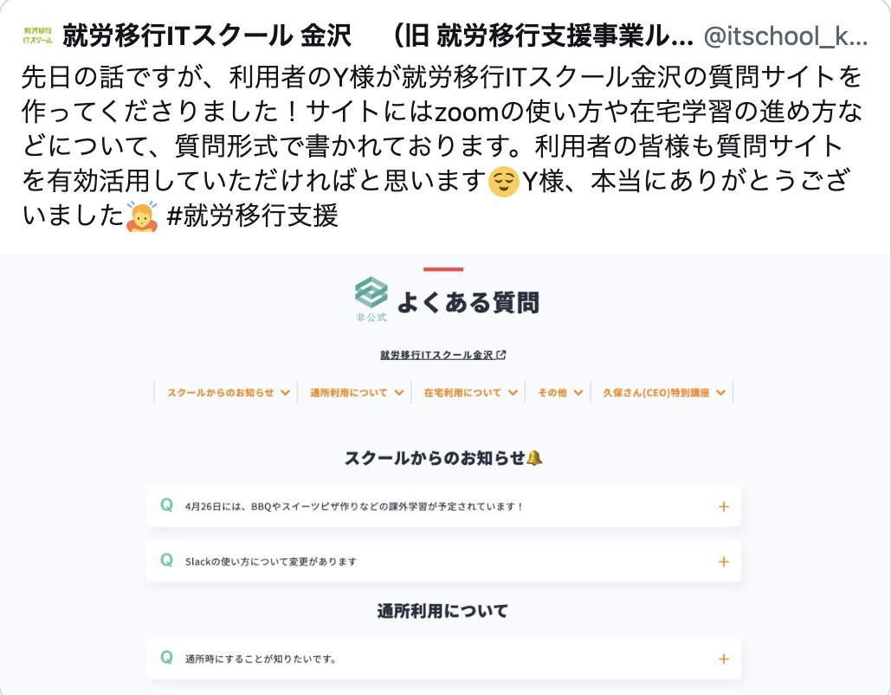

# 就労移行支援ITスクール金沢　よくある質問(非公式)
**https://school-faq.netlify.app/**  

https://user-images.githubusercontent.com/98888061/220252133-e7854fec-83df-46d1-9ef1-7b27bf1a1d0f.mov

## 概要
利用者が作った就労移行ITスクール金沢のよくある質問サイトです。

## アピールポイント
・自分から提案することができる  

・確認をとりながらタスクを進めることができる  

・実装手順をドキュメントにまとめることができる  
**[Qiita記事:よくある質問の作り方](https://qiita.com/yamazaki2357/items/40daf5f188ca58b61e91)**

・実際にスクールで使っていただいている

  

https://twitter.com/itschool_knzw/status/1648193665842708480?s=20

  
  

## 実装において工夫した点

・コミュニケーションが取れることを伝えたかったので、自分一人では完成しないテーマを選びました。　　

・実際にスクールで使ってもらえるように意識してデザインと項目内容を考えました。　　

・スクール側から利用者の質問募集をしてCEOが回答するという機会があったので、
注目度が高くなるチャンスと捉えて、CEOの質問回答を組み込み4日後に完成させてスクール内に公開しました。

Slackのやりとり　　

## 技術
・HTML  
・CSS  
・JavaScript  

分析ツール  
・Clarity
